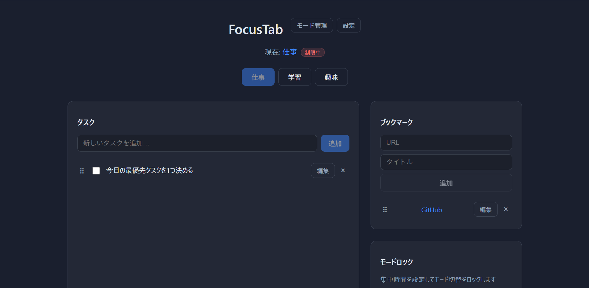
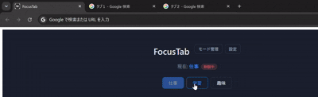
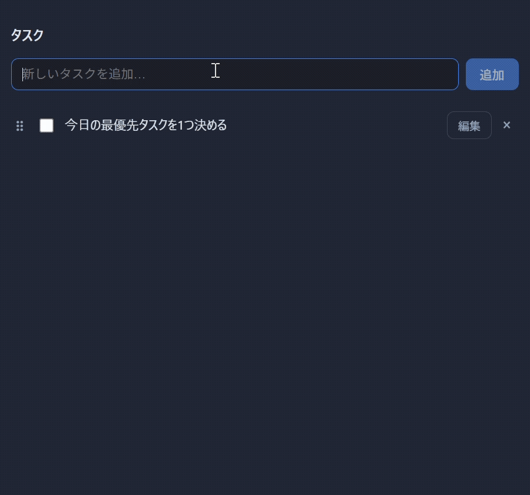
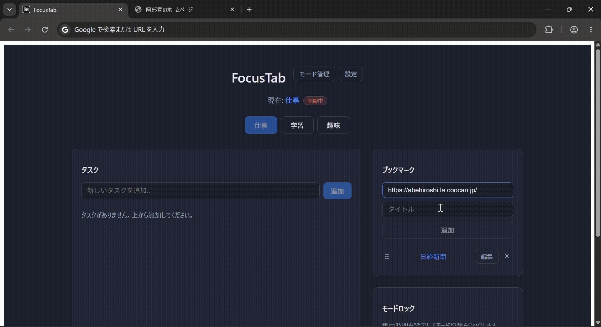
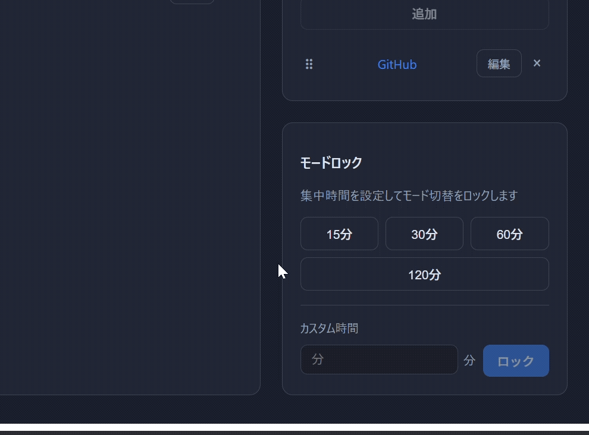
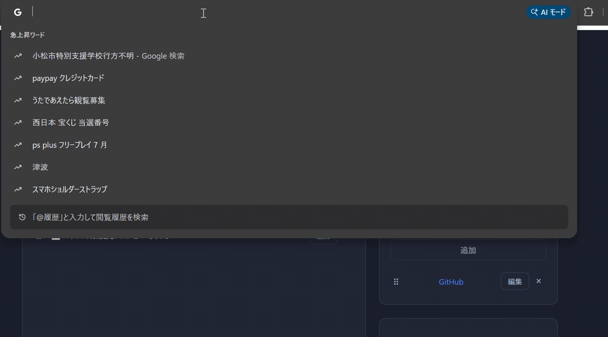
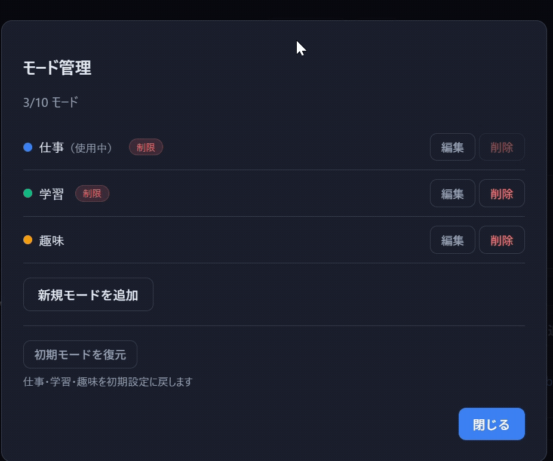
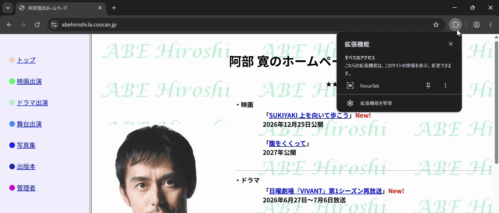

# 🔒FocusTab

FocusTab は、新規タブを集中ポータルに置き換える Chrome 拡張機能です。仕事、学習、趣味などの「モード」ごとに、開いているタブ、タスク、ブックマーク、閲覧制限をまとめて切り替えられます。

データはすべてブラウザ内に保存されます。アカウント登録やクラウド同期は不要です。

## こんなときに使えます

- 仕事モードでは SNS や動画サイトをブロックしたい
- 学習モードでは教材リンクと学習タスクだけを表示したい
- 趣味モードでは制限なしで自由に使いたい
- 今のタブをいったん退避して、別の作業用タブセットに切り替えたい
- 集中時間中はモード切替をできないようにしたい

## 目次

- [主な機能](#主な機能)
- [インストール](#インストール)
- [使い方](#使い方)
- [デフォルトモード](#デフォルトモード)
- [プライバシーと権限](#プライバシーと権限)
- [開発](#開発)

<!-- ここにリンク: FocusTab ポータル全体が分かるスクリーンショット -->
<p align="center">
  
</p>

## 主な機能

| 機能                   | できること                                                                       |
| ---------------------- | -------------------------------------------------------------------------------- |
| モード切替             | 現在のタブを退避し、選択したモードに保存されているタブを復元します               |
| 閲覧制限               | 制限付きモードでは、ブラックリストに登録したドメインへのアクセスをブロックします |
| タスク管理             | モードごとにタスクを追加、編集、完了、削除、並び替えできます                     |
| タスクアーカイブ       | 完了タスクをアーカイブし、必要に応じて復元または一括削除できます                 |
| ブックマーク           | モードごとにクイックリンクを登録、編集、並び替えできます                         |
| モードロック           | 15 / 30 / 60 / 120 分のプリセットでモード切替をロックできます                    |
| 緊急解除               | ロック中のみ、固定文の手入力でモードロックを解除できます                         |
| モード管理             | カスタムモードを作成、編集、削除できます                                         |
| バックアップ           | データを JSON 形式でエクスポート、インポートできます                             |
| ツールバーポップアップ | 現在モードの確認、モード切替、ポータルや設定への移動ができます                   |

## インストール

### 開発ビルドを Chrome に読み込む

```bash
git clone <このリポジトリの URL>
cd FocusTab
npm install
npm run build
```

1. Chrome で `chrome://extensions` を開く
2. 右上の **デベロッパーモード** をオンにする
3. **パッケージ化されていない拡張機能を読み込む** をクリックする
4. `.output/chrome-mv3` を選択する

### 開発中に読み込む

開発中は HMR 用の開発サーバーを起動したままにします。

```bash
npm install
npm run dev
```

Chrome では `.output/chrome-mv3-dev` を読み込んでください。本番ビルド用の `.output/chrome-mv3` とは別です。

### 配布用 ZIP を作る

```bash
npm run zip
```

`.output/focustab-<version>-chrome.zip` が生成されます。

## 使い方

### 初回起動

新しいタブを開くと FocusTab ポータルが表示されます。初回はオンボーディングが表示され、モード、閲覧制限、プライバシー方針を確認できます。

### モード切替

<!-- ここにリンク: モードを切り替え、タブが退避・復元される流れが分かる短い GIF -->
<p align="center">
  
</p>

ポータル上部のモードボタンから切り替えます。

切り替え時には、現在開いているタブが現在モードのタブスナップショットとして退避されます。その後、切り替え先モードに保存されているタブが復元されます。

設定で「切替前に確認ダイアログを表示」をオンにしている場合は、切り替え前に確認が表示されます。モードロック中は切り替えできません。

### タスク

<!-- ここにリンク: タスクの追加、編集、完了、アーカイブが分かる短い GIF -->
<p align="center">
  
</p>

左側のタスクパネルで、モードごとのタスクを管理できます。

| 操作       | 方法                                   |
| ---------- | -------------------------------------- |
| 追加       | 入力欄にタスクを書いて **追加** を押す |
| 編集       | タスク横の **編集** を押し、保存する   |
| 完了       | チェックボックスをオンにする           |
| 並び替え   | 未完了タスクをドラッグする             |
| アーカイブ | 完了済みタスクの **アーカイブ** を押す |
| 復元       | アーカイブ一覧を開き、**復元** を押す  |
| 一括削除   | アーカイブ一覧の **すべて削除** を押す |

### ブックマーク

<!-- ここにリンク: ブックマークの追加、編集、並び替えが分かる短い GIF -->
<p align="center">
  
</p>

右側のブックマークパネルで、モードごとのクイックリンクを管理できます。URL は `https://` を省略して入力しても、自動で補完されます。

| 操作     | 方法                                       |
| -------- | ------------------------------------------ |
| 追加     | URL とタイトルを入力して **追加** を押す   |
| 編集     | ブックマーク横の **編集** を押し、保存する |
| 並び替え | ブックマークをドラッグする                 |
| 開く     | ブックマーク名をクリックする               |

### モードロック

<!-- ここにリンク: ロック時間の選択と残り時間表示が分かる画像 -->
<p align="center">
  
</p>

右側のモードロックパネルから、15 / 30 / 60 / 120 分を選択できます。ロック中はモード切替ができず、残り時間が表示されます。

ロックは「モード切替を止める」ための機能です。閲覧制限そのものの解除とは別です。

### 閲覧制限とブロック画面

<!-- ここにリンク: 制限サイトにアクセスしたときのブロック画面 -->
<p align="center">
  
</p>

制限付きモードでは、ブラックリストに登録したドメインへのアクセスがブロックされます。ブロック時は専用ページが表示され、**タスク一覧へ** からポータルに戻れます。

SPA のクライアントサイド遷移も補完しているため、ページ内遷移で制限対象へ移動した場合もブロックされます。

短縮 URL は別ドメインとして扱われます。たとえば `youtu.be` を止めたい場合は、`youtube.com` とは別にブラックリストへ追加してください。

### 緊急解除

モードロック中に制限サイトへアクセスすると、ブロック画面の右下に **モードロック解除** が表示されます。

固定文を正確に手入力すると、モードロックのみ解除されます。コピー＆ペーストでは解除できません。

```text
集中を中断すると今日の目標が遠のきます。本当に解除しますか？
```

緊急解除後も、そのサイトへの閲覧制限は続きます。別のモードに切り替える場合は、ポータルに戻って操作してください。

### モード管理

<!-- ここにリンク: モード名、色、閲覧制限、ブラックリストを編集している画面 -->
<p align="center">
  

ヘッダーの **モード管理** から、モードを作成、編集、削除できます。

- モード名、アクセントカラー、閲覧制限の有無を設定できます
- 制限付きモードではブラックリストを登録できます
- ブラックリストは 1 行 1 ドメインで入力します
- デフォルトの 3 モードも編集できます
- **初期モードを復元** で、仕事、学習、趣味の設定を初期状態へ戻せます
- 使用中のモードは削除できません

### 設定とバックアップ

ヘッダーの **設定** から、次の項目を変更できます。

| 設定                         | 内容                                           |
| ---------------------------- | ---------------------------------------------- |
| 切替前に確認ダイアログを表示 | モード切替前に確認します                       |
| タブ復元の進捗を表示         | 復元中の進捗バナーを表示します                 |
| 復元バッチサイズ             | 一度に開くタブ数を 1 から 5 の範囲で調整します |
| エクスポート                 | すべてのデータを JSON ファイルとして保存します |
| インポート                   | JSON ファイルからデータを復元します            |

インポートすると現在のデータは上書きされます。必要に応じて先にエクスポートしてください。

### ツールバーから使う

<!-- ここにリンク: ポップアップで現在モードと切替ボタンが見える画像 -->
<p align="center">
  
</p>

Chrome のツールバーにある FocusTab アイコンをクリックすると、ポップアップが開きます。ポップアップでは現在モードとロック状態を確認でき、モード切替、ポータルを開く、設定を開く操作ができます。

## デフォルトモード

初回インストール時には、次の 3 モードが作成されます。

| モード | 閲覧制限 | ブロック例                                          |
| ------ | -------- | --------------------------------------------------- |
| 仕事   | あり     | YouTube、X、Instagram、TikTok、Reddit、Netflix など |
| 学習   | あり     | YouTube、X、Instagram、TikTok、Reddit など          |
| 趣味   | なし     | なし                                                |

サンプルのタスクとブックマークも登録されます。

## プライバシーと権限

FocusTab はローカルファーストの拡張機能です。タスク、ブックマーク、タブスナップショット、設定は `chrome.storage` に保存され、外部サーバーへ送信されません。

| 権限                                  | 用途                                 |
| ------------------------------------- | ------------------------------------ |
| `tabs`                                | モード切替時のタブ退避と復元         |
| `storage`                             | 設定、タスク、ブックマークなどの保存 |
| `alarms`                              | モードロックの期限管理               |
| `declarativeNetRequest`               | ブラックリストドメインのブロック     |
| `declarativeNetRequestWithHostAccess` | DNR ルールの適用                     |
| `webNavigation`                       | ページ遷移時のブロック判定           |
| `<all_urls>`                          | DNR とナビゲーション監視の対象       |

ページ本文を読み取ったり、閲覧履歴を外部へ送信したりすることはありません。

## 制限事項

- 対応ブラウザは Chromium 系ブラウザです。Chrome / Edge などの Manifest V3 環境を想定しています
- モードあたり最大 100 タスク、50 ブックマーク、200 ブラックリストドメインまで登録できます
- タブスナップショットはモードあたり最大 30 タブです
- カスタムモードは最大 10 個です
- 閲覧制限はドメインベースです。VPN、別ブラウザ、別プロファイルなどは制限対象外になる場合があります

## 開発

### 要件

- Node.js 18 以上
- npm 9 以上

### コマンド

```bash
npm install
npm run dev         # 開発サーバー + HMR
npm run build       # 本番ビルド
npm run zip         # 配布用 ZIP
npm test            # ユニットテスト
npm run test:watch  # テストのウォッチモード
```

### 技術スタック

- [WXT](https://wxt.dev/)
- React 19
- TypeScript
- Vitest
- Zod
- Chrome Extensions API

### プロジェクト構成

```text
FocusTab/
├── assets/                 # 拡張機能アイコンの元画像
├── entrypoints/
│   ├── background/         # Service Worker、モード切替、DNR、ロック
│   ├── blocked/            # 閲覧制限時のブロック画面
│   ├── newtab/             # 新規タブポータル UI
│   ├── options/            # 拡張機能オプション
│   └── popup/              # ツールバーポップアップ
├── shared/
│   ├── migration/          # storage マイグレーション
│   ├── schemas/            # Zod データモデル
│   └── seed/               # 初期データ
├── tests/                  # Vitest セットアップ、Chrome API モック
└── wxt.config.ts
```
